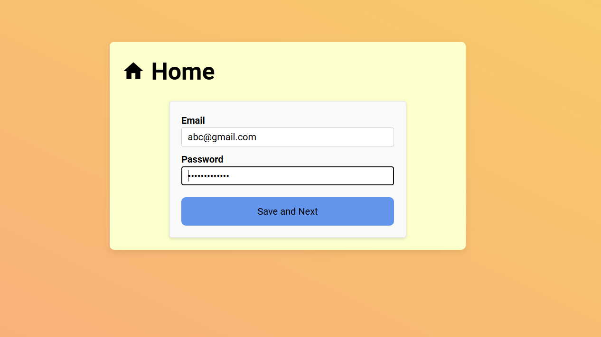
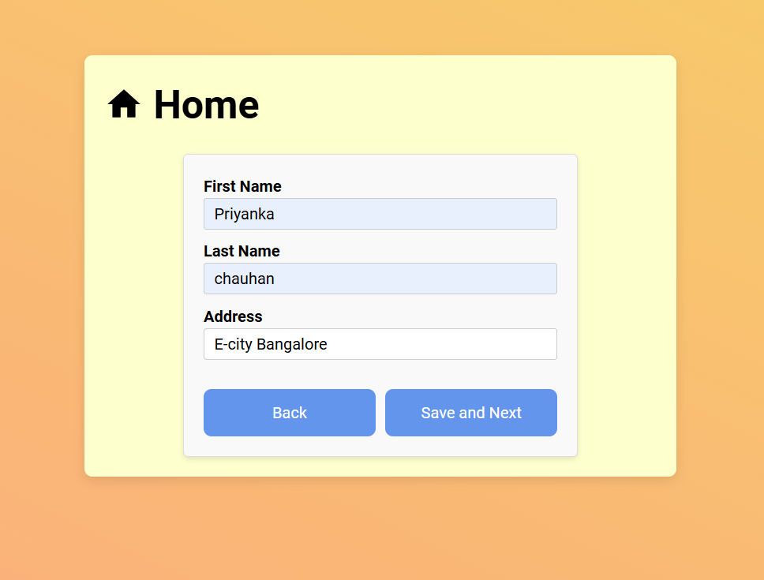
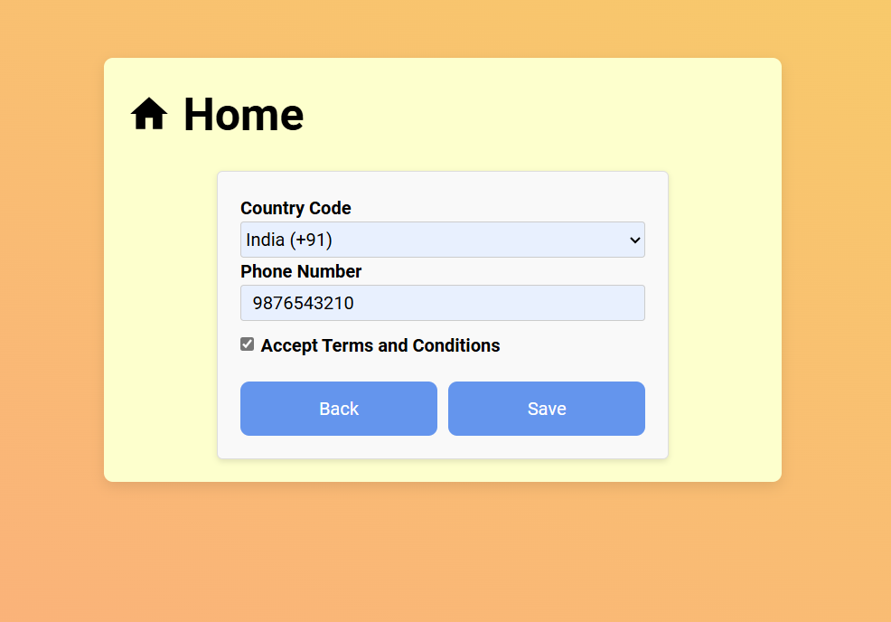
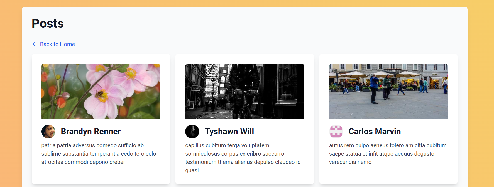

# Multi-Step Form(Codebuddy Assignment)

*Form Step 1:*


*Form Step 2:*


*Form Step 3:*


*Posts:*



## Getting Started

To get started with this project, follow the steps below:

## Pre-requisites

1. You must have NodeJS (v18+) installed on your machine
2. You must have a basic understanding of React, React Router, Tailwind CSS, etc.
3. You must have a basic understanding of Git and GitHub
4. You must have VS Code installed on your machine

## Installation

> **_Please read the below instructions carefully. Complete all the steps sequentially_**.

1. **_FORK_** this repo to your own GitHub account. **_DON'T CLONE THIS REPO_**. Fork button is the top right corner of the GitHub page.
2. Clone the **FORKED** repo to your local machine.
3. Open the project folder in VS Code
4. Install the recommended plugins
   - [EditorConfig](https://marketplace.visualstudio.com/items?itemName=EditorConfig.EditorConfig)
   - [ESLint](https://marketplace.visualstudio.com/items?itemName=dbaeumer.vscode-eslint)
   - [Prettier](https://marketplace.visualstudio.com/items?itemName=esbenp.prettier-vscode)
   - or open `.vscode/extensions.json` to see the list of recommended plugins and install them manually
5. Install `node_modules` using `npm` or `yarn` or `pnpm`.

   ```sh
   npm install
   ```

   OR

   ```sh
   yarn install
   ```

   OR

   ```sh
   pnpm install
   ```

6. Run `npm run dev` or `yarn dev` to run the project.
7. Project will start at http://localhost:5173

> If you are on Windows and getting lot of ESLint errors due end of line characters CRLF please run the below command to fix it.

```sh
npm run format
```

> **NOTE**: If you face issue installing with `npm` trying using `yarn v1.22.*`

> **NOTE**: You might be asked to do HTTP calls to https://codebuddy.review , the API mentioned in the Question Set will only work if you do a fetch request from the application as it served using MSW (Mock Service Worker) https://mswjs.io/. **So it won't work if you try to do a fetch request from Postman or any other tool**. Check for message `[MSW] Mocking enabled` in the browser console to confirm that the API is working.

---

> In case of any queries feel free to contact us
